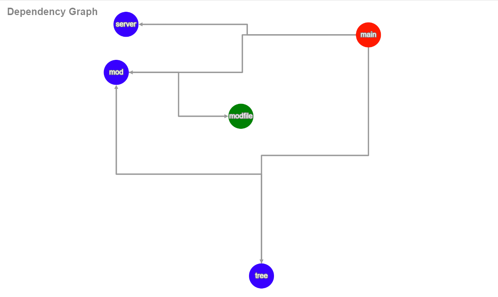

# depgraph

Interactive dependency graph visualization tool for golang using the awesome [cytoscape](https://cytoscape.org/) graph visualizer.



## Install

Install via:

``` sh
 go install github.com/becheran/depgraph@latest
```

## Quick Start

Run the *depgraph* command line tool next to you *go.mod* file of your project.

The first required argument is the path to the file or module which shall be observed. For example:

``` sh
depgraph ./main.go
```

or:

``` sh
depgraph github.com/becheran/depgraph 
```

Per default the frontend will be started on **http://localhost:3001**. The address can be changed via the *host* flag:

``` sh
depgraph -host=localhost8080 github.com/becheran/depgraph 
```
